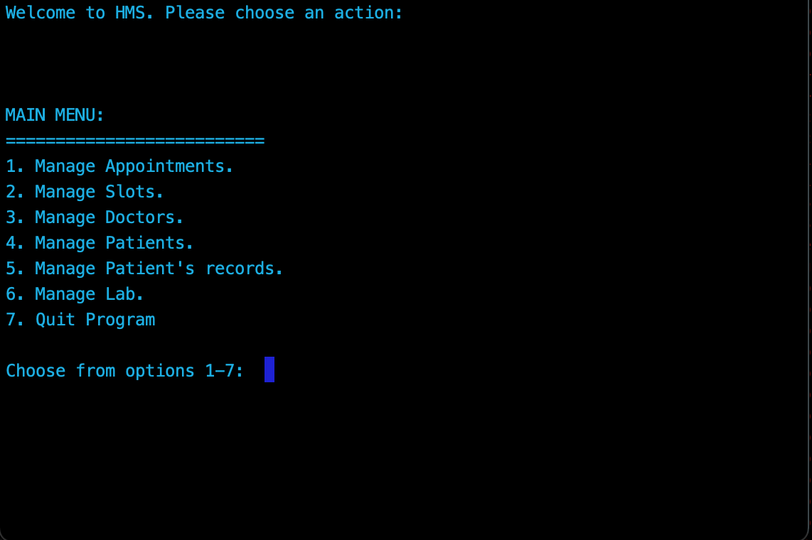

# :hospital: Hospital Management System :health_worker:

Made using C++

A **Hospital Management System** that allows you to manage appointments, slots, doctors, patients, patient records, and reads from text files to allow for changes. This is a command line program.

This project uses *OOP*, *Classes*, *Encapsulation*, *Data Abstraction*, and Input and Output files. 

In order to compile and run this project, you need to download the directory (zip folder) and then you can use the makefile to run the program. Running ‘make’ while in the directory, will create an executable file (you may need to chmod +x the file to change the permission in order to execute it).

---
### Running Make to get an executable:
```zsh
$ make
```
### Run the executable by: (* g++ must be already installed *)
:
```zsh
$ ./main
```
#### Sample output:



> Each Main Menu option (except for quit program) contains a subset menu of options to choose from


Doctor information, patient information, date and time of appointments, diagnosis's, and  available slots are all imported from a text file.


